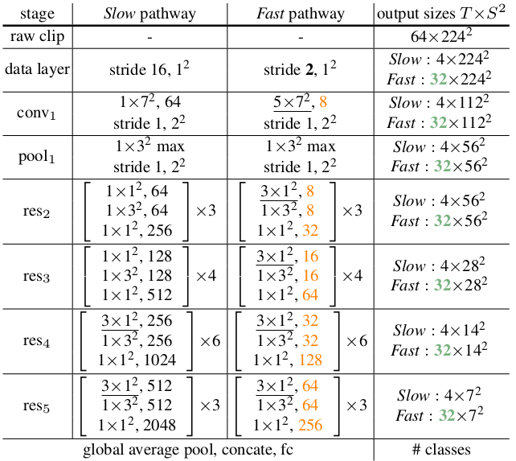

#### 工程名称： SlowFast

#### 功能： 动作分类

#### 地址：192.168.1.32： 

​						git@192.168.1.32:stephen/slowfast.git

​						https://192.168.1.32/stephen/slowfast.git

​						已经将范老师加入项目

#### 说明

安装和使用可以参考工程中相关的指导文件

工程主要包含两个分支： visualization， master

### visualization：

​		主要实现推断可视化，使用训练好的模型进行推断时，实时显示当期视频的groundtruth， 预测结果和推断时间，并将对每个视频的可视化结果保存为指定文件夹中的同名文视频。主要的修改在 tools/test_net.py 文件中，可视化结果的保存目录也被硬编码在该文件中。

### master

​		master分之包含工程的所有功能的实现，除推断可视化之外。

参考文件：当前目录下论文： SlowFast_Network_for_Video_Recognition

##### 网络结构

模型的输入是一个列表：[slow, fast]

其中 slow size : [B, 3, 8, H, W],		fast : [B, 3, 32, H, W]

代码实现中训练用图片的空间维度是： 224 × 224， 测试时是 256×256。

网络的结构与途中网络结构一致，基于resnet50 ，改写而成。

#### 配置文件

​		主要配置文件： configs/myconfig/Kinetics/SLOWFAST_8x8_R50*.yaml

​		文件名中带有’local‘的用于本地主机调试使用，不带有‘local’的用于服务器训练和测试使用。配置文件中相关参数的具体含义可以参考  slowfast/config/defaults.py 文件

#### tensorRT移植

1、 pytorch导出onnx模型

​		文件： my_tools/export_onnx.py

​		该文件主要功能是加载训练好的模型并导出为onnx模型，以便根据onnx模型导出为tesnortRT模型

​		文件中可能包含一些非必要的代码，但是并不影响性能，所以并没有删除，后期可以根据需求删除不必要的代码。重点是torch.onnx,export 函数，可以参考该函数的功能和用法

2、 onnx -- > tensorRT

​		onnx --> tensorRT， 即由onnx模型转化为tensorRT模型可以由工程 onnx-tensorrt-7.1 完成，相关的用法可以参考该工程的说明文档，工程地址：git@github.com:onnx/onnx-tensorrt.git 。

​		还可以通过文件  my_tools/infer_with_trt_without_torch.py 实现，该程序实现：

​		如果指定名称的tensorRT引擎已经存在，则读取引擎，否则读取指定的onnx模型并转换为tensorRT引擎，用来推断。

​		注意： 如果是需要在xavier等嵌入式平台上进行推断，则必须在嵌入式平台上构建tensorRT引擎，而不能使用pc生成的tensorRT引擎直接读取，因为tensorRT引擎的构建与硬件相关，使用pc生成的引擎通常不能在xavier上直接读取，会报错

3、Demo

​		程序所在文件： my_tools/multiProcessing.py

​		该程序实现了一个简单的demo，即：

 * 读取现有引擎，或者根据onnx模型构建引擎

 * 从制定相机中读取指定数量的视频帧用于预测

 * 显示当前正在预测的视频切片，并将切片的预测结果打印输出

   

   存在的问题：

   ​	目前该demo虽然使用了多线程，除了主线程进行数据处理和推断外，还有另一个线程用于在进行推断时，循环播放当前正在推断的视频切片。但依然存在卡顿的情况，视频的显示不流畅。

### 工程存在的问题

目前该工程存在的主要问题还是数据不足的问题，有效数据只有不到一个小时，并且数据的录制是仅由3个人完成，录制人员单一，并且录制环境单一，所以训练用的数据本身就存在严重的不足。

目前基于131个视频的最好预测精度是90%，但是这只是在当前数据内进行的测试，如果将该训练结果用到其他的请将，相信预测的精度会更低一些，所以现有训练模型的普适性是一个最主要的问题。但是碍于目前人力有限，所以不能得到比较满意的数据集，希望日后这方面能够加强工作。

另外， 目前实现了一个简单的基于相机输入的demo，但是测试来看还不能到达很流畅的实时预测，这方面还有改进的空间。

​		

​		

​		